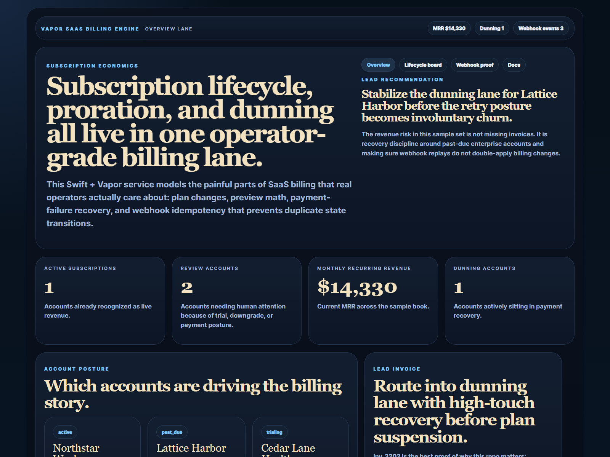
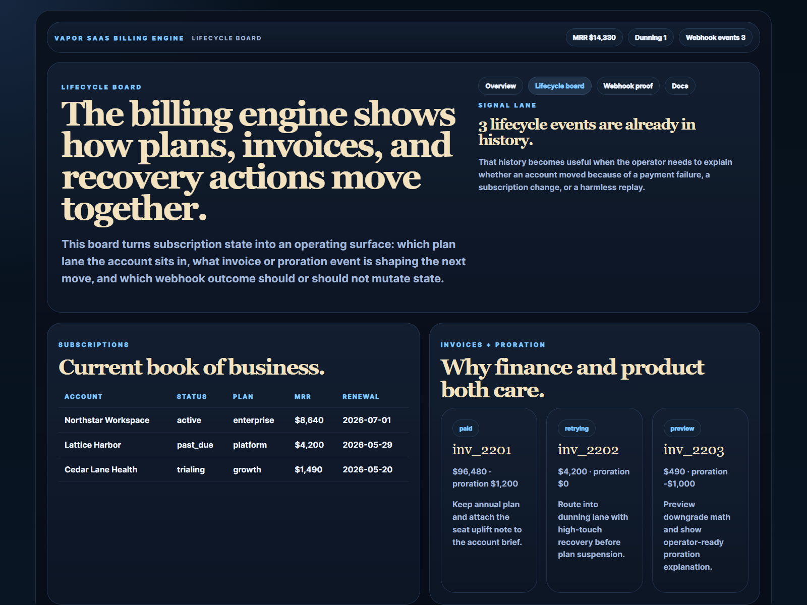
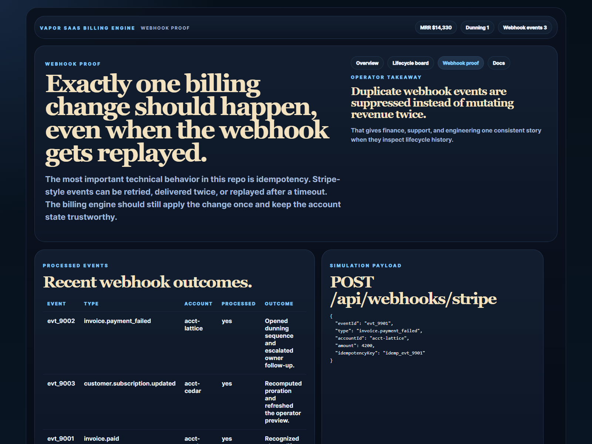
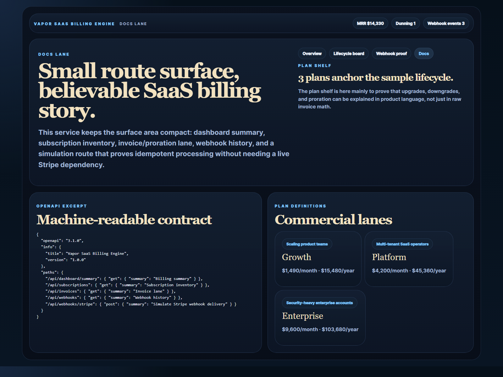

# Vapor SaaS Billing Engine

Swift Vapor billing engine for subscription lifecycle, proration, dunning, and webhook idempotency.

## Why this repo is good

- It shows server-side Swift on a very commercially legible SaaS problem.
- It focuses on the parts of billing that operators actually care about: upgrades, downgrades, recovery, and replay-safe webhook handling.
- It complements `tenant-access-control-plane`, `payment-event-ledger-eos`, and `knowledge-memory-workbench` without feeling repetitive.
- It includes proof surfaces, tests, CI, and an OpenAPI contract instead of stopping at a code sample.

## Screenshots






## What it does

- models SaaS plans, subscription state, invoice posture, and dunning pressure
- simulates Stripe-style webhook delivery with idempotency-key suppression
- exposes a clean API for dashboard summary, subscriptions, invoices, and webhook history
- ships HTML proof routes for overview, lifecycle, verification, and docs
- publishes an OpenAPI JSON contract at `/openapi.json`

## Local run

```powershell
cd vapor-saas-billing-engine
swift run
```

Open:

- `http://127.0.0.1:4624/`
- `http://127.0.0.1:4624/lifecycle`
- `http://127.0.0.1:4624/verification`
- `http://127.0.0.1:4624/docs`

If the port is busy:

```powershell
$env:PORT = "4628"
swift run
```

## Validation

```powershell
swift build
swift test
```

## Important Windows note

On this machine, local Vapor dependency checkout is currently blocked by Windows symlink restrictions in upstream Swift packages. The source code, tests, CI, docs, and proof layer are all in place, but a full local `swift build` here requires either:

- Windows Developer Mode enabled
- or elevated symlink permissions

The GitHub Actions workflow validates the package on environments that can check out those dependencies cleanly.

## API routes

- `GET /api/dashboard/summary`
- `GET /api/subscriptions`
- `GET /api/invoices`
- `GET /api/webhooks`
- `GET /api/sample`
- `POST /api/webhooks/stripe`
- `GET /openapi.json`

Example webhook payload:

```json
{
  "eventId": "evt_9901",
  "type": "invoice.payment_failed",
  "accountId": "acct-lattice",
  "amount": 4200,
  "idempotencyKey": "idemp_evt_9901"
}
```

## Repo anatomy

- [Sources/App/main.swift](./Sources/App/main.swift)
- [Sources/App/BillingStore.swift](./Sources/App/BillingStore.swift)
- [Sources/App/Render.swift](./Sources/App/Render.swift)
- [Sources/App/OpenAPISpec.swift](./Sources/App/OpenAPISpec.swift)
- [docs/architecture.md](./docs/architecture.md)
- [docs/openapi.json](./docs/openapi.json)
